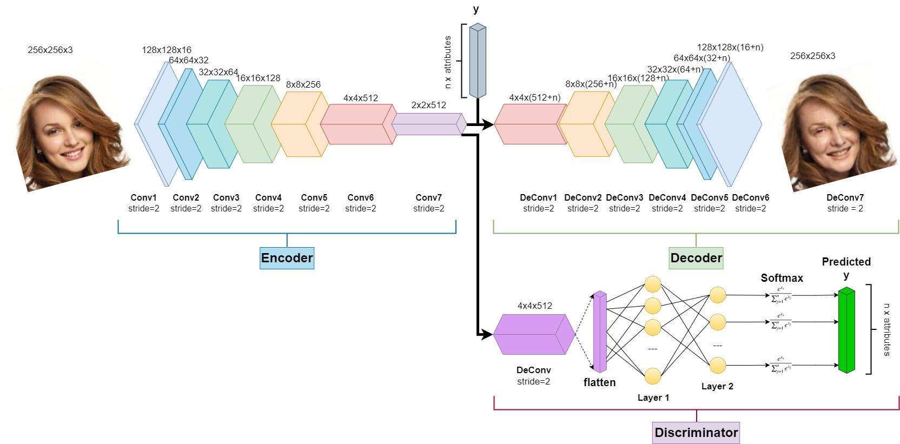
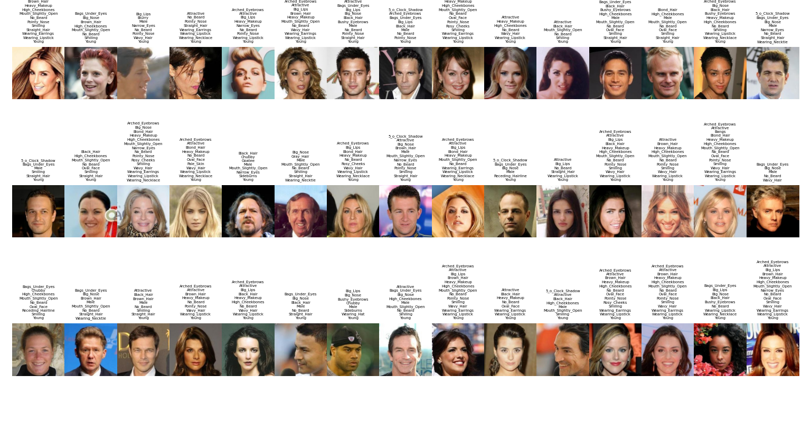
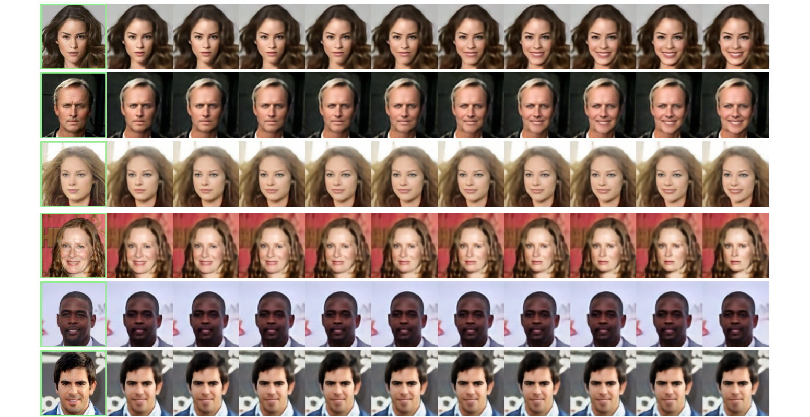

# Fader Networks : Manipulating Images by Sliding Attributes

## Introduction

This repository showcases our machine learning project using [Pytorch](https://pytorch.org/), inspired by [Fader Networks](https://arxiv.org/abs/1706.00409) concept introduced by Guillaume Lample, Neil Zeghidour, Nicolas Usunier, Antoine Bordes, Ludovic Denoyer, and Marc'Aurelio Ranzato.

Fader Networks employ an encoder-decoder architecture to modify attributes of real images, such as gender, age, and the addition of eccesories like glasses. Throughout this process, the network preserves the intrinsic character of the image while generating diverse and realistic versions.

## Autors

HAMDI Massyl Yanis  
NIAT ACHOUR Younes   
FEDDAK Lynda  

## *Fader Nework global architecture:*




## Dependencies
- Python
- [Pytorch](https://pytorch.org/)
- [NumPy](https://numpy.org/)
- [ScriPy](https://scipy.org/)
- [OpenCV](https://opencv.org/)

## Data
The dataset that we used is the [CelebA](https://mmlab.ie.cuhk.edu.hk/projects/CelebA.html) dataset, which is easily accessible and consisting of 202,599 images. Extract all the images and save them in the `datafolder/img_align_celeba/` directory. Additionally, the dataset provides a file `list_attr_celeba.txt` containing the list of the 40 attributes associated with each image, save it in the `datafolder/` directory. In order to preprocess the dataset, execute the folliwing command: 
```batch
python preprocess.py --root_images "your/path/to/resized/images/folder" --root_attributes "your/path/to/attributes/file"
```

it will generate the `datafolder/resized_images/` file where images are resized from `178x218x3` to `256x256x3`. Another file containing mapped attributes will be generated at `datafolder/processed_attributes/`, following scheme: `-1` is mapped to `[0, 1]`, and `1` is mapped to `[1, 0]`. 

The dataset is organized in the following structure:
```
datafolder
|- resized_images
|  | 000001.jpg
|  | 000002.jpg
|  | 000003.jpg
|  | 000004.jpg
...
|  processed_attributes
```
Above are samples of images along with their attributes, as well as a histogram presentation showing the number of appearances for each attribute in the training, evaluation, and test sets:



## Train your own models
You can esily train a new model with train.py. It will train the encoder, decoder and discriminator. At real time a graphic of losses est mis a jour losses of : the reconstruc loss , adversial loss and discriminator loss. Below is a complete list of all parameters:


```bash
python train.py
  --root_rszimages               # Path to the directory containing resized images
  --root_attributes              # Path to the directory containing processed attributes
  --attr_chg "Smiling"           # Attributes to be modified 
  --epochs_max                   # Maximum number of epochs for the training loop
  --save_interval                # Interval between epochs to save model checkpoints
  --checkpoint_dir               # Directory to save model checkpoints
  --encoder_checkpoint           # Path to the encoder checkpoint file for resuming training
  --decoder_checkpoint           # Path to the decoder checkpoint file for resuming training
  --discriminator_checkpoint     # Path to the discriminator checkpoint file for resuming training
```

Run the following command to start the training :
```batch
%run train.py 
```

## Grid Interpolation Results
Here we added a weight \alpha multiply to the attributes to see the reconstructed images step by step. we use the test dataset run this following commant with precizing the parameters :
```batch
# Smiling
python Interpolation.py --root_rszimages "your/path/to/resized/images/folder" --root_attributes "your/path/to/attributes/file" --attr_chg ["Smiling"] --encoder_fpath "your/path/to/encoder/smiling/model" --decoder_fpath "your/path/to/decoder/smiling/model" --discriminator_fpath "your/path/to/discriminator/smiling/model" --nb_alpha 10 --nb-x2flip 1 

# Eyeglasses
python Interpolation.py --root_rszimages "your/path/to/resized/images/folder" --root_attributes "your/path/to/attributes/file" --attr_chg ["Smiling"] --encoder_fpath "your/path/to/encoder/eyeglasses/model" --decoder_fpath "your/path/to/decoder/eyeglasses/model" --discriminator_fpath "your/path/to/discriminator/eyeglasses/model" --nb_alpha 10 --nb-x2flip 1 

# Gender
python Interpolation.py --root_rszimages "your/path/to/resized/images/folder" --root_attributes "your/path/to/attributes/file" --attr_chg ["Smiling"] --encoder_fpath "your/path/to/encoder/gender/model" --decoder_fpath "your/path/to/decoder/gender/model" --discriminator_fpath "your/path/to/discriminator/gender/model" --nb_alpha 10 --nb-x2flip 1 

```
Here are our results :


## *Rapport sur overleaf*:
https://www.overleaf.com/project/65707d2d277e0e67e96e8232
