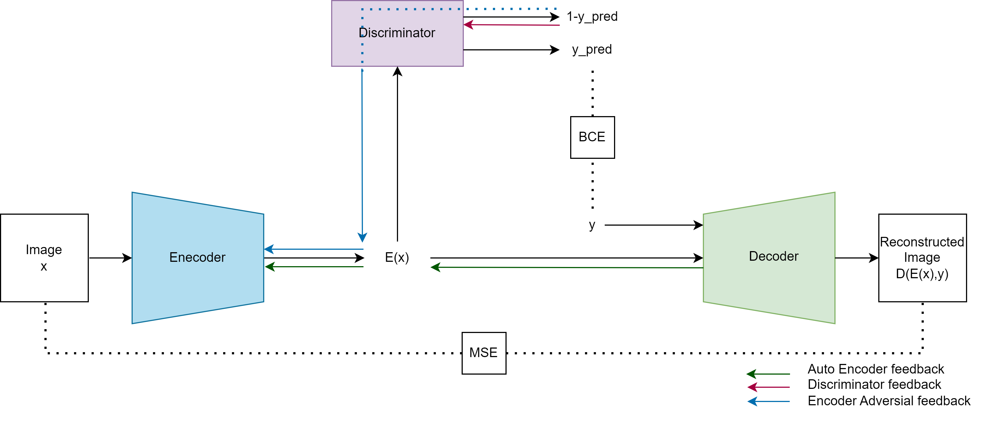

# Fader Networks : Manipulating Images by Sliding Attributes

## Introduction

This repository showcases our machine learning project using [Pytorch](https://pytorch.org/), inspired by [Fader Networks](https://arxiv.org/abs/1706.00409) concept introduced by Guillaume Lample, Neil Zeghidour, Nicolas Usunier, Antoine Bordes, Ludovic Denoyer, and Marc'Aurelio Ranzato.

Fader Networks employ an encoder-decoder architecture to modify attributes of real images, such as gender, age, and the addition of eccesories like glasses. Throughout this process, the network preserves the intrinsic character of the image while generating diverse and realistic versions.

## Autors

HAMADI Massyl Yanis
NIAT ACHOUR Younes 
FEDDAK Lynda

## *Fader Nework global architecture:*



## Dependencies
- Python
- [Pytorch](https://pytorch.org/)
- [NumPy](https://numpy.org/)
- [ScriPy](https://scipy.org/)
- [OpenCV](https://opencv.org/)

## Dataset
The dataset that we used is the [CelebA](https://mmlab.ie.cuhk.edu.hk/projects/CelebA.html) dataset, which is easily accessible and consisting of 202,599 images. Extract all the images and save them in the `data/img_align_celeba/` directory. Additionally, the dataset provides a file `list_attr_celeba.txt` containing the list of the 40 attributes associated with each image, save it in the `data/` directory. In order to preprocess the dataset, execute the folliwing command: 

```batch
./preprocess.py
```

it will generate the `data/resized_images/` file where images are resized from `178x218x3` to `256x256x3`. Another file containing mapped attributes will be generated at `data/processed_attributes.pt/`, following scheme: `-1` is mapped to `[0, 1]`, and `1` is mapped to `[1, 0]`. 

## *Rapport sur overleaf*:
https://www.overleaf.com/project/65707d2d277e0e67e96e8232
